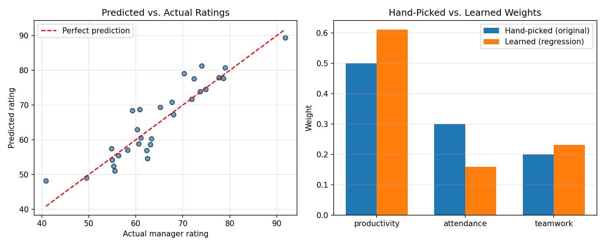

# Weighted Scoring Engine — Learned Weights (Linear Regression)

An extension of the [Weighted Scoring Toolkit](../weighted-scoring-toolkit) that
replaces hand-picked scoring weights with weights **learned from data** using
linear regression — turning a fixed formula into an actual machine learning
model.

## The problem with the original approach

The original toolkit scored employees with:

```
score = 0.5 * productivity + 0.3 * attendance + 0.2 * teamwork
```

Those weights (0.5 / 0.3 / 0.2) were guessed. There's no reason to believe
that's actually how a manager weighs these factors when forming an overall
rating.

## The ML approach

Instead of guessing, this trains a **linear regression model** on labeled
data (employee metrics → manager's overall rating) so the weights are
**learned** from real examples, not assumed.

```
manager_rating ≈ w1·productivity + w2·attendance + w3·teamwork + bias
```

`w1`, `w2`, `w3`, and the bias are all fit by `scikit-learn`'s
`LinearRegression`, not chosen by hand.

## Results

On a held-out test set:
- **R² = 0.82** — the model explains ~82% of the variance in manager ratings
- **MAE = 3.29** — predictions are off by ~3 rating points on average

The learned weights turned out meaningfully different from the original
guess — most notably, the model learned that **attendance matters less**
and **productivity matters more** than the hand-picked formula assumed:

| Feature | Hand-picked (original) | Learned (regression) |
|---|---|---|
| Productivity | 0.50 | 0.61 |
| Attendance | 0.30 | 0.16 |
| Teamwork | 0.20 | 0.23 |



## Usage

```bash
pip install pandas numpy scikit-learn matplotlib

python generate_data.py   # creates employee_ratings.csv (synthetic demo data)
python train_model.py     # trains the model, prints metrics, saves plot
```

## Data note

`employee_ratings.csv` is a small **synthetic dataset** generated by
`generate_data.py` for this demo — not real company data. The generator
adds realistic noise to simulate the subjectivity of manager ratings. Swap
in any real labeled dataset with the same three feature columns and a
target column, and the pipeline runs unchanged.

## What this demonstrates

- Supervised learning (regression) applied to a scoring problem
- Train/test split and evaluation (R², MAE) rather than eyeballing results
- Comparing a learned model against a naive baseline (the original
  hand-picked formula) to quantify whether the "smart" approach is actually
  better
- Using a trained model to score new, unseen data points
